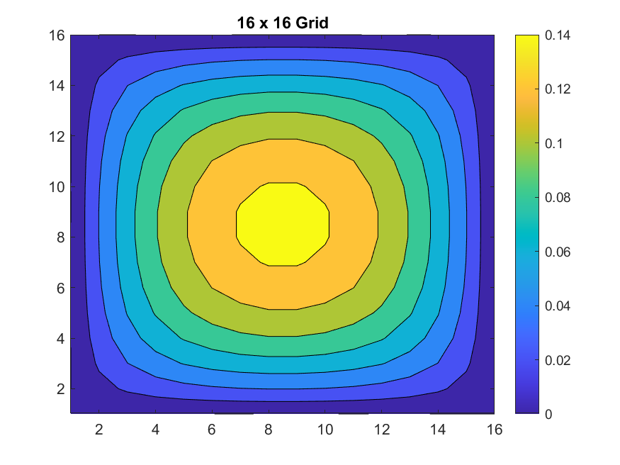
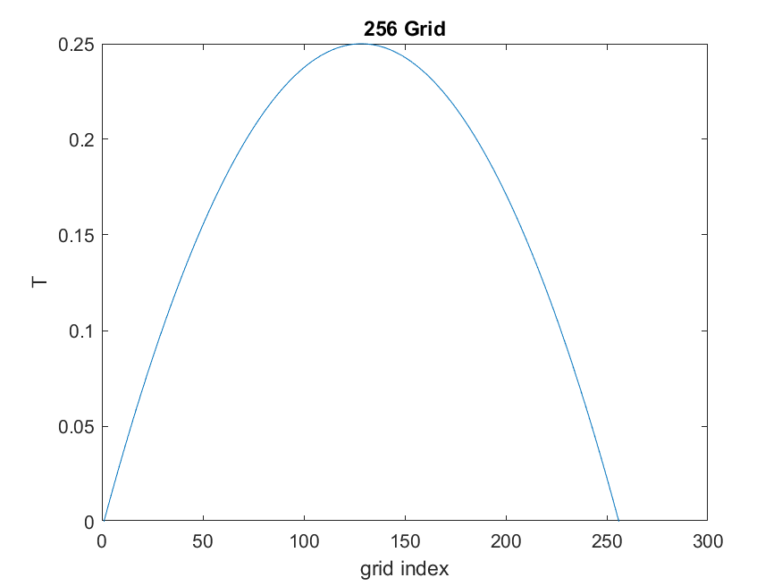
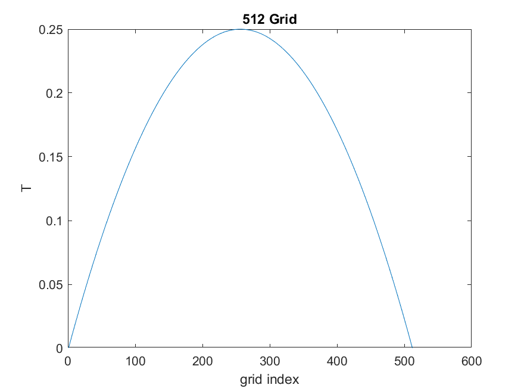
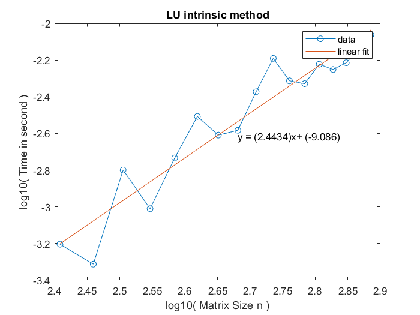
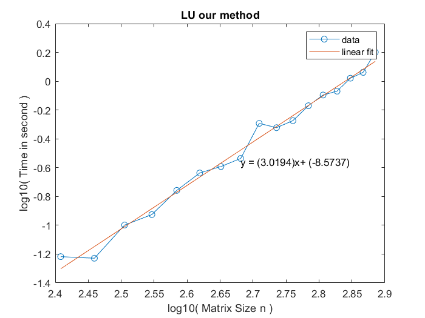
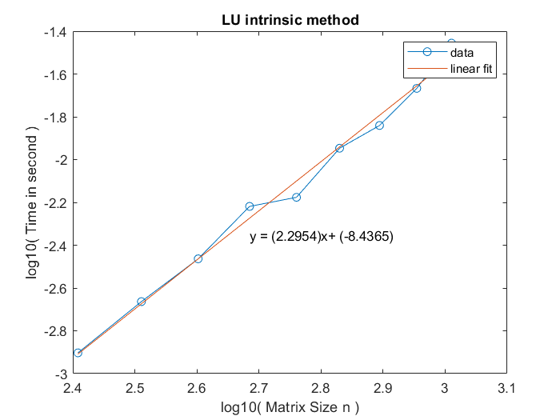
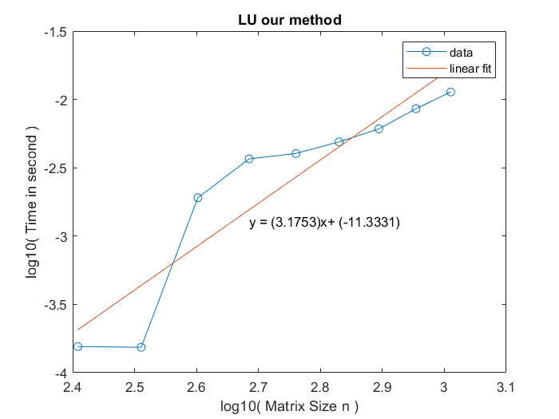
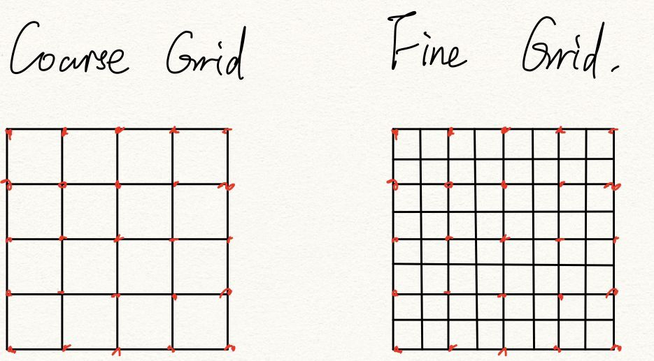
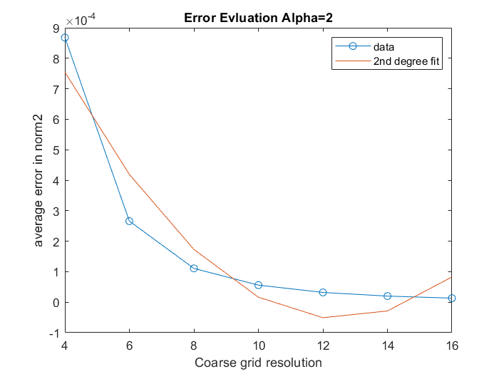
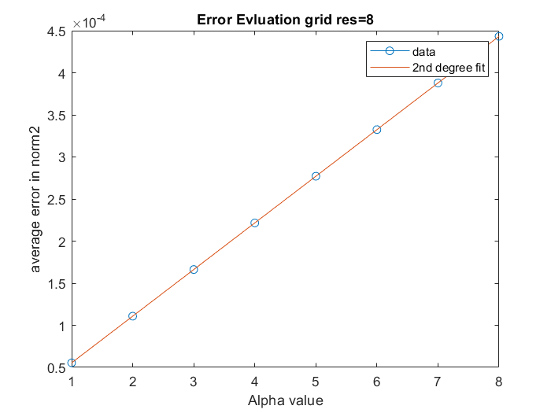

### Ling xie

### ENM 502-001

### 2021-02-21

### Assignment 2 LU Decomposition


## Introduction

In this homework we are about to implement the **LU decomposition** in Matlab. Basically, **lower–upper** (**LU**) **decomposition** or **factorization** factors a [matrix](https://en.wikipedia.org/wiki/Matrix_(mathematics)) as the product of a lower [triangular matrix](https://en.wikipedia.org/wiki/Triangular_matrix) and an upper triangular matrix. The number of operations is about `O(n^3)`, where n is the one dimension of the decomposed matrix.
$$
A=L U
$$
which looks just like this:
$$
\left[\begin{array}{ccc}
a_{11} & a_{12} & a_{13} \\
a_{21} & a_{22} & a_{23} \\
a_{31} & a_{32} & a_{33}
\end{array}\right]=\left[\begin{array}{ccc}
l_{11} & 0 & 0 \\
l_{21} & l_{22} & 0 \\
l_{31} & l_{32} & l_{33}
\end{array}\right]\left[\begin{array}{ccc}
u_{11} & u_{12} & u_{13} \\
0 & u_{22} & u_{23} \\
0 & 0 & u_{33}
\end{array}\right]
$$
The we use the implemented **LU decomposition** to solve the boundary value problem(**BVP**) discretized by finite difference method.

## Problems 

For the rest of the report, I would briefly answer the question raised in each problem statement. 


#### **Problem 1: LU decomposition** and **partial** **pivoting**.

The LU decomposition pipeline follows the pseudocode code. The relevant files are `Pivot.m, Decompose.m, LuDecom.m`.


#### Problem 2: Diffusion problem

The diffusion problem is defined as
$$
\nabla^{2} T+\alpha=0 \quad \text { with } \quad T=0 \text{ on all boundaries}
$$
The linear system generating code( produce the `A`and `b`) is `DiffusionBVP.m`.


#### Problem 3: Solve the diffusion BVP, α = 2.

| 1D                         | 2D                        |
| -------------------------- | ------------------------- |
|  |  |
|  |  |
|  |  |

##### Notable findings:

[xxx] Currently we haven't found notable findings 😓. Noticeably, the pattern showed in the 2D cases are becoming more and more rounded with the increasing of the grid resolution, which means the results are getting better due to the increasing resolution of the grid.

#### Problem 4: Against the intrinsic Matlab LU function

##### Compare with Intrinsic method

Here we compare the `Decompose`functino with **Matlab** intrinsic `lu`function by solving `Ax = b`. `A` and `b` are generated by random. The matrix size ranges from `256x256` to `768x768`.

| Matlab intrinsic(Fig:3)         | Our method(Fig:4)         |
| ------------------------------- | ------------------------- |
|  |  |

Here we compare the whole pipeline(**i.e.** solving `Ax=b`) performance. We compare the grid resolution from `16x16` to `32x32` (**i.e.** matrix `A` size from `256x256` to `1024x1024`).

| Matlab intrinsic(Fig:5)         | Our method(Fig:6)         |
| ------------------------------- | ------------------------- |
|  |  |


##### How does the performance of your decomposition code compare to the intrinsic MATLAB **LU** routine?

From the Fig:3 and Fig:4, we could see that our method log curve is basically scale with constant 3(means O(n^3) overall complexity), as expected. 

While the intrinsic `lu` scales with constant `2` if we apply linear fit( actually it is not from the Fig:3). Well the official `lu` document states that the complexity is also O(n^3). So there must be some inside "dirty" optimization trick with the `lu`.


#####  Does the timing scale as you expect for **LU** in each case? Why or why not?

From the `Fig:3~6`, the timing basically fit our expectation. However , there is still much `noise`, where makes the line does not fit perfectly on constant `3`.  

From the view of **memory bandwidth**, we guess the memory fetch(we refer to read) for the matrix `A` would cause a constant amount of time on the whole process. As the `n` (size of `A`) goes up, the whole pipeline is gradually dominated by the **LU decomposition** calculation itself. As we could see in `Fig:4`, after some oscillations one first small `n`, the line's slope gradually becomes around `3`.

Besides this, some other process(like overhead of each operation) would surely add some constant on the whole performance. 

##### 1D vs 2D

Compared to **1D**, the matrix A of **2D** has a wider **matrix** **bandwidth** than cases in **1D**. Because the **2D** version would have **one more dimension** to take into consideration when building the matrix `A`. Since the current iterative techniques are generally more efficient for sparser matrices, so solving **2D** cases(with larger bandwidth) would have **more number of operations** than **1D** (assume  they are solving the same `A`).

#### Problem 5: Plot the solution error

Here we define the solution error as the **L2-norms** between the fine grid and coarse grid.

| Fig:7                         |
| ----------------------------- |
|  |

##### Define the error

Given a coarse grid and a fine grid, which represents the field under different resolution, we calculate the **L2-norms** between the same place on each grid(the red dot).

We are solving the diffusion problem as defined in **problem 2**.

##### Left: we show the error on the grid resolution. The resolution ranges from 4x4 to 16x16; α = 2.  

##### Right: error on α. α ranges from 1:8. 

| Error on resolution(Fig:5) | Error on α(Fig:6)           |
| -------------------------- | --------------------------- |
|   |  |

##### Error on resolution

As the resolution goes up, the error gradually decreases. From `Fig:5`, the error decreasing tendency could be roughly fit by two degree.

##### Error on α

As the α goes up, the error also goes up linearly. To explain this intuitively, thinking about the equation `Ax = b`. When `b` is multiplied by a constant, the equality could be held by multiply the same constant on `x`.

#### Appendix

##### Source Code

To reproduce the results, you could run the `main.m` file section by section( seperated by token %%) in **Matlab**.

```matlab
%% Sanity Check
% whether the Lu decompose is right
SanityCheck(10:2:20);

%% Q2
n = 256:32:768;
test_time = 4;

Q2(n, test_time);

%% Q3_b
%% 1D
res = 512;
dim = 1;
Q3_b(res, dim);

%% 2D
res = 64;
dim = 2;
Q3_b(res, dim);

%% Q3_b
% benchmark our method and intrinsic method
Q3_b_benchmark(16:2:32, 10, 2);

%% Q3_c1
% err on resolution
Q3_c1(4:2:16, 2);


%% Q3_c2
% err on alpha
Q3_c2(8, 1:1:8);
```

Print all of my code on report is way too clunky. You could clone the **Github** repo [here](https://github.com/Jack12xl/ENM502-2021/settings), which contains my full source code.

