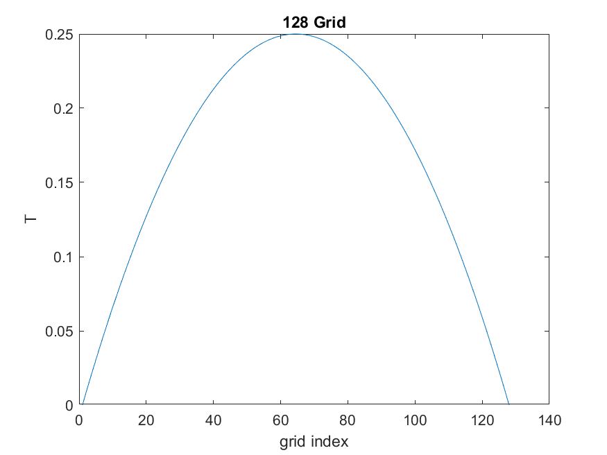

### Ling xie

### ENM 502-001

### 2021-02-21

### Assignment 2

# LU Decomposition

## Introduction

In this homework we are about to implement the LU decomposition in Matlab. Basically, **lower–upper** (**LU**) **decomposition** or **factorization** factors a [matrix](https://en.wikipedia.org/wiki/Matrix_(mathematics)) as the product of a lower [triangular matrix](https://en.wikipedia.org/wiki/Triangular_matrix) and an upper triangular matrix. 
$$
A=L U
$$
Looking just like this:
$$
\left[\begin{array}{ccc}
a_{11} & a_{12} & a_{13} \\
a_{21} & a_{22} & a_{23} \\
a_{31} & a_{32} & a_{33}
\end{array}\right]=\left[\begin{array}{ccc}
l_{11} & 0 & 0 \\
l_{21} & l_{22} & 0 \\
l_{31} & l_{32} & l_{33}
\end{array}\right]\left[\begin{array}{ccc}
u_{11} & u_{12} & u_{13} \\
0 & u_{22} & u_{23} \\
0 & 0 & u_{33}
\end{array}\right]
$$
The we will use the implemented **LU decomposition** to solve the boundary value problem(**BVP**) discretized by finite difference method.

The diffusion problem is defined like this:

## Problems 

For the rest of the report, I would briefly answer the question raised in each problem statement.

#### **Problem 1: LU decomposition** and **partial** **pivoting**.

The LU decomposition pipeline follows the pseudocode code. The relevant files are `Pivot.m, Decompose.m, LuDecom.m`.

#### Problem 2: Diffusion problem

The diffusion problem is defined as[xxx]
$$
\nabla^{2} T+\alpha=0 \quad \text { with } \quad T=0 \text{ on all boundaries}
$$
The linear system generating code( produce the `A`and `b`) is `DiffusionBVP.m`.

#### Problem 3: Solve the diffusion BVP, α = 2.

| 1D                         | 2D                        |
| -------------------------- | ------------------------- |
|  |  |
|  |  |
|  |  |

##### Notable findings:

[xxx]

#### Problem 4: Against the intrinsic Matlab LU function

##### Compare with Intrinsic method

Here we compare the `Decompose`functino with **Matlab** intrinsic `lu`function by solving `Ax = b`. `A` and `b` are generated by random.

| Matlab intrinsic(Fig:3)         | Our method(Fig:1)         |
| ------------------------------- | ------------------------- |
|  |  |

#### Problem 5: Plot the solution error

Here we define the solution error as the L2-norms between the fine grid and coarse grid.